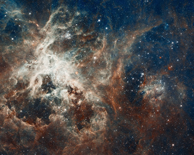
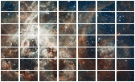

# IMGTAILS

This code allow create an mosaic from image,
the input of code is an full resolution image
the output is similar to image from Figure 2:

### Input

### Output

### Usage

You need to change parameters to __config.xml__
file to change options from code. This is options
from code:

- __type_process:__ Define if image is *GRID*(value 0) or WALL (value 1)
- __showflag:__ Set 1 to display output final_image
- __saveflag:__ Set 1 to save segments of main image.
- __htails:__ Number of horizontal segments.
- __vtails:__ Number of vertical segments.
- __height:__ height on pixels of each segment.
- __width:__ width on pixels of each segment.
- __padding:__ value on pixels of padding of each segment.
- __paddingcolor:__ value of padding color 0 for black and 255 for White.
- __margin:__ value separation on pixels between segments.
- __margincolor:__ value of margin color 0 for black and 255 for White.
- __margin_ext:__ value of external margin.
- __margin_ext_color:__ value of margin color 0 for black and 255 for White.
- __window_limits:__ region of interest from input image.
- __image:__ input image filename.
